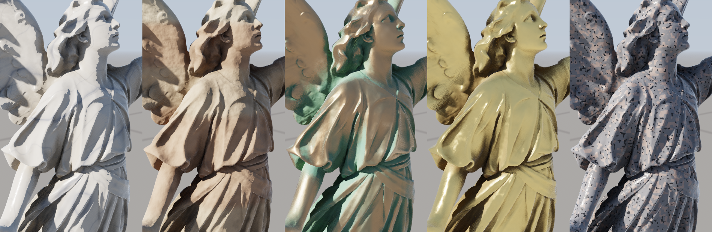
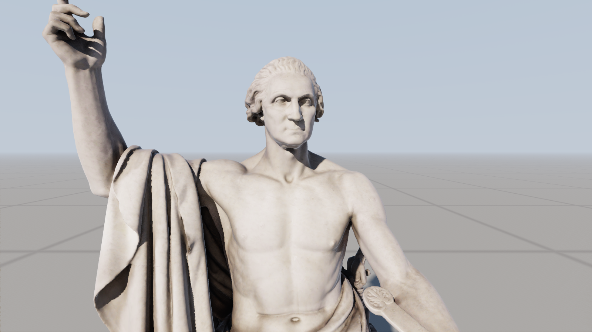

# colossus

[](https://github.com/apollo-2006/colossus/actions/workflows/ci.yml)
[](LICENSE)

virtualized geometry from scratch, in c++20 and vulkan. a builder turns a scanned model
into a crack-free hierarchy of clusters; a renderer streams it from disk and draws
thousands of copies, picking per cluster the coarsest detail within a pixel of the
original. it's the idea behind unreal engine 5's nanite, built here with nothing but
vulkan and glfw: clustering, simplification, partitioning, streaming, culling, both
rasterizers, shadows and shading all live in this repository.

**[fly through it in your browser →](https://apollo-2006.github.io/colossus/)** the
webgpu port ([in the browser](#in-the-browser)), with the debug views, the error
threshold and the crowd size there to play with.


900 instances of lucy (28 million triangles) and the xyz rgb dragon (7.2 million): 15.9
billion triangles at full detail, drawn at 1920x1080 in 1.45 ms on an rx 9070 xt, soft
shadows, bounce light, ambient occlusion, weathered stone and bronze, and antialiasing
included. about
4.8 million triangles reach the screen, from about 20 mb of the 427 mb on disk, each
cluster provably within a pixel of the original. a million instances (17.6 trillion
triangles) take 1.79 ms, and instances can move and sway.

## how it works

### building the hierarchy (`colossus_build`)

* **clusters.** at most 128 triangles and 128 vertices each (`src/cluster.cpp`), by
  recursive bisection of the triangle graph: two far seeds, breadth-first growth, a cut
  at a whole number of clusters, then swaps to shorten it. every cluster comes out full:
  the dragon makes 56,404 leaves at 128.0 triangles on average. the greedy grower before
  it left 8% as small walled-in pockets.
* **groups, locked, simplified.** each level's clusters form groups of about eight by
  shared edges (`src/dag.cpp`). vertices shared between groups are locked, each group is
  merged and simplified to half, and the result becomes the next level's clusters.
  locked outlines meet their neighbours edge for edge; groups fall differently each
  level, so no seam outlives a level.
* **quadric simplification.** `src/simplify.cpp` collapses edges cheapest first by
  quadric error (garland and heckbert). collapses keep an endpoint, so every level
  indexes the original vertices and the hierarchy shares one vertex buffer. no flips,
  no pinches (the link condition), no lost islands; hole rims only slide along
  themselves.
* **proven errors that only grow.** a quadric is a mean and can understate the worst
  spot, so each group's simplification is bounded against what it replaced
  (`src/deviation.cpp`): an upper bound on the two-sided distance between them, not a
  sample. over a piece of triangle the distance to one triangle of the other mesh is
  convex, so at most its largest at the piece's corners; pieces whose bound could still
  beat the worst distance found split in four, until every bound is within 10% of it.
  a test checks it against brute force on random points. its error is its children's
  plus the larger of that and the estimate, plus the grid snapping the pages store
  (half a step's diagonal); groups sampling over four times their estimate are retried
  more gently. errors only grow toward the root, so
  `own error on screen <= 1 pixel < parent error on screen` picks exactly one level on
  every path, one gpu thread per cluster, no tree to walk.
* **checked for cracks.** every level uses the original vertices, so a crack is exact:
  an edge used by one cut triangle whose ends aren't both on a hole. `--check` tests 25
  cuts. lucy builds 23 levels in 5.6 minutes, the dragon 21 in 52 s (proving the bounds
  is most of it; sampling took 84 and 21 s), every cut with 0 cracked edges.
* **one small root.** near the top, thin parts and hole rims stall edge collapses (lucy
  used to stop at three roots of 313 triangles). nothing borders the last group, so
  vertex clustering takes over there, keeping duplicate triangles and hole vertices so
  the crack check still holds. lucy now ends in one root of 20 triangles, the dragon in
  one of 32.
* **texture coordinates.** a textured obj's corners become wedges: a vertex as one texture
  chart sees it, so a vertex on a seam has one per chart. a collapse moves each corner onto
  the kept vertex's wedge in the same chart and is refused where there is none, so seams
  only slide along themselves and every level's coordinates are the original's, exactly.
  a photogrammetry atlas has hundreds of small charts, which pins that rule down: the
  washington scan below stalled at 28 thousand triangles with every group stuck. a stuck
  group retries with its seams free to move, a corner then keeping its coordinates on a
  new wedge at the kept vertex. positions are still shared, so still no cracks, and the
  texture slips across the seam by no more than the collapse moved, which the error
  already counts. clusters count wedges against their 128 vertex limit. the scan builds
  in 4.7 minutes and 4 gb of memory, 17 million triangles over 20 levels.

### drawing it (`colossus`)

1. **instance culling.** instances sit in cells of 8x8; `cell_cull.comp` tests each
   cell's sphere against the frustum and depth pyramid before any instance is read.
   `instance_cull.comp` then culls the visible cells' instances, one per invocation, and
   binary searches each one's clusters (stored by parent error) for the ones that could
   draw at its distance: a far instance tests a short tail, not all 445k. near instances,
   thousands of work items each, get a workgroup of their own (`expand.comp`).
2. **cluster culling** (`cluster_cull.comp`): lod cut, frustum, normal cone, occlusion.
   it began as a task shader; on radv that took 1.13 ms for 630k clusters, as compute
   0.39 ms. the lod cut projects an error honestly: a point at p moved by e moves at most
   `lod_scale * e * |p| / z^2` pixels, which grows away from the screen's centre (2.2x in
   a 16:9 corner), so a sphere is judged by its least depth and the angle of its point
   farthest off axis, capped at the screen's corner. the usual `error / distance` was
   up to about two pixels where it promised one.
3. **two rasterizers.** clusters over 32 pixels go to mesh shaders; smaller ones to
   `sw_raster.comp`, a compute rasterizer, since pixel-sized triangles are what the
   hardware handles worst. both write `depth << 32 | (cluster, triangle)` into one
   64-bit visibility buffer by atomic max. the compute path snaps to 1/256 pixel with a
   top-left rule, so the two meet without gaps, and keeps its edge functions in 32 bits
   (rdna has no 64-bit multiply; the 64-bit version lost at every size).
4. **occlusion in two passes.** pass 1 tests cells, instances and clusters against last
   frame's depth pyramid and draws what it can't prove hidden; a pyramid built from that
   lets pass 2 recover anything newly visible. moving instances are tested where they
   were last frame.
5. **shading** (`shade.comp`) refetches each pixel's triangle and hits it with the
   pixel's ray for exact barycentrics. five materials (marble, sandstone, granite, bronze,
   gold), lambert plus a ggx lobe. the scans carry no uvs, so their surfaces come from 3d
   value noise in each model's own space, with its analytic gradient tilting the normal
   for relief: veined marble with a soft, light-bleeding falloff and a polish, layered and
   pitted sandstone, granite of quartz, feldspar and mica grains, hammered gold, and
   bronze that patinates where it would: in recesses (from the ambient occlusion), on
   upward faces and down rain streaks, worn back to bright metal on exposed parts.
   octaves finer than a pixel fade out, so distant statues don't shimmer. 0.25 ms over
   plain materials (`--materials plain`, or one of them for every statue with
   `--materials bronze`). sky, reflected and rim light are scaled by
   ground-truth ambient occlusion (`ao.comp`, after jimenez and intel's xegtao): half
   resolution, two slices a pixel rotated each frame for taa to average, reading a small
   depth chain (`ao_depth.comp`) so far taps stay in cache; `--no-ao` or g.

   the same pass gathers bounce light, the light arriving from anything but the sun and
   sky. the ground is the biggest source: it's shaded analytically and isn't in any
   depth buffer, so four rays down each pixel's cosine lobe land on it, and each takes
   the ground's light where it lands, in sun or in a statue's shadow (a hard lookup in
   the shadow maps). nearby surfaces bounce in screen space: each horizon sample that
   newly hides part of the sky sends, over that part's cosine weight, the light it showed
   last frame (taa's history, reprojected, its tone curve undone), so bounces add up over
   frames. sunlit ground warms the statues' shadow sides and light carries into the folds.
   0.17 ms; `--no-bounce` or b. with ray traced shadows (`--shadows rt`) the ground's
   shadows are rays too.

   a textured model's colour comes from its texture instead. the neighbouring pixels'
   rays meet the same triangle's plane for the texture coordinates' change across a pixel,
   which picks the mip level; texels are decoded by hand from the page pool (below) and
   blended bilinear within a level and linear between two. on the scan it shades in 0.61
   ms where the procedural marble took 0.78.

   screen space only sees the screen: what's off it or behind something bounces nothing,
   and the ground, in no depth buffer, receives nothing from the statues. on gpus with
   ray queries `--gi rt` (or i) traces the bounce in world space instead: four rays a
   pixel, ground pixels too, against the shadow copies, each hit lit by the sun through a
   shadow ray and by the sky, its normal read from the hit triangle's own vertices
   (`VK_KHR_ray_tracing_position_fetch`). the ground darkens where statues hide its sky
   and brightens beside their sunlit sides. four rays are noisy, so shading reads them
   through a 3x3 of half-resolution texels weighted by depth. 0.5 to 0.6 ms over the screen space kind.
6. **shadows: virtual shadow maps** (`vsm.glsl`, `vsm_*.comp`). the sun's depth lives in
   a clipmap around the camera: 14 levels of 32x32 pages of 128x128 texels, the finest
   texel 1/4096 of a unit and each level's twice the last's, backed by a pool of physical
   pages (48x48 by default, `--vsm-pages`). each frame every pixel marks the page it will
   read, missing pages get physical ones, and only new or invalid pages are drawn, from
   the same hierarchy seen from the sun with errors in that level's texels. a surface
   turned toward grazing light stretches a texel over more of itself, so where a 2x2
   block of pixels is one smooth surface its normal asks for a level or two finer: that's
   what keeps shadow edges along lucy's folds from stepping. when the pool runs short,
   free pages go first, then pages unneeded for eight frames, then recent ones.

   pages keep two layers: still instances, drawn once (or until their geometry has
   loaded), and moving ones, redrawn where something moved and skipped by lookups where
   empty. at coarse levels a mover marks its pages only every few frames, as many as it
   takes to move half a texel there (from a bound on its fastest point), so a page is
   never more than half a texel behind. the rasterizer draws only triangles facing the sun, clips each triangle's walk
   to the pages being drawn, and hands big ones (coarse stand-ins before finer geometry
   arrives) to the whole workgroup. the atlas is stored page after page in 8x8 texel
   tiles, so a small triangle's texels share a cache line or two. with the camera still
   the shadow pages cost 0.08 ms.

   shadows soften with distance from what casts them: a blocker search sizes each
   penumbra for a sun drawn 1.5 degrees wide (a little wider than the real one, so it
   shows at statue scale), then rotated taps filter over it for taa to average. 0.11
   ms; `--hard-shadows` or j.

   ray traced shadows are still there (`--shadows rt`): coarser copies of each model,
   half resolution with full resolution at edges, moving instances in a refitted second
   structure, a swaying one with its bend's chord as a shear (exact at its foot and top,
   within 0.03 of its radius between). hard edged, they cost about what the soft shadow maps do here, grow with the
   instance count and need ray queries; the shadow maps draw from the full hierarchy, so
   fine folds shadow themselves in more detail.

7. **antialiasing** (`taa.comp`). eight sub-pixel offsets in turn, each pixel blended 10%
   into a history reprojected through last frame's camera (and a moving instance's last
   transform), catmull-rom sampled and clamped to the 3x3 neighbourhood. 0.05 to 0.07 ms.
8. **streaming.** only bounds and errors stay resident, 48 bytes a cluster: a group's
   clusters share their bounds and error, so those sit once per page, and the normal
   cone, offsets and counts pack into spare bits (lucy's resident data went from 50 mb to
   22). geometry lives in pages, one per group, loaded into a fixed pool (`--pool-mb`, 1 gb by default) as the gpu asks. a
   cluster that would rather be its finer clusters requests their page, with its error
   on screen as priority; `viewer/streamer.hpp` loads the most wanted, evicting least
   recently used, on eight loader threads. pages close together in the file share a
   read, and the file keeps each level's groups together, so a frame's requests (mostly
   siblings) merge well.

   cuts stay whole because a page is resident only while the pages of its coarser
   stand-ins are: loads go coarsest first and publish in issue order, and a page is
   evicted only when nothing resident or loading depends on it. whatever has loaded,
   exactly one cluster draws on every path.

   the streamer also prefetches the pages below a request while they'd still be too
   coarse: each page knows its clusters' error, and a request's priority over its page's
   error gives the screen scale for predicting its children's. a shadow page drawn while
   a cluster it needs is missing asks for that cluster's page itself (waiting on its
   coarser stand-ins to ask could stall forever, their spheres being loose). from a cold
   file cache a lucy close-up settles in 11 frames (about 38 ms), the crowd above in 12
   (34 ms); with one read per page, two loader threads, halving-guess prefetch and the
   shadow raster walking whole triangles, they took 440 and 210 ms.

   pages are bit-packed per cluster. positions snap to a grid over the model and store
   their offset from the cluster's corner in just the bits its extent needs per axis,
   normals are 11 + 11 bit octahedral, and triangle indices take the bits the vertex
   count needs; the widths ride in the cluster's level word. shared vertices snap to the
   same grid point in each cluster, so quantizing opens no cracks. lucy's pages went
   from 460 mb to 337, the dragon's from 119 to 90.

   textures stream through the same pool (`include/texture_file.hpp`,
   `viewer/shaders/texture.glsl`). `colossus_build` cuts each mip level into tiles of
   128x128 texels, 120 of the level and a 4 texel border so bilinear filtering never
   leaves a tile, bc1 compressed (8 kb a tile; the washington scan's 4096x4096 texture is
   1,669 tiles, 13 mb). each tile is a page whose dependency is the tile one level
   coarser over it, so the rule above keeps every resident tile's coarser copies resident
   and the coarsest is pinned: a missing tile asks to be loaded and the finest resident
   copy draws meanwhile, its priority doubling with each level coarser. textured
   clusters add their coordinates after their vertices: the cluster's corner on a 65535
   step grid and offsets in just the bits its spread needs, 32% more page data on the
   test sphere.

   the crowd above reads about 20 mb. a 300 frame flight with a 16 mb pool evicts 15,029
   pages and reads 114 mb in 7,552 reads, and at frames 100, 200 and 300 shows about as
   many isolated empty pixels as a 1 gb pool (140 and 140, 109 and 110, 55 and 53, of
   two million): the small pool's cut is coarser in places, not torn. from a cold file cache the render
   thread's worst frame in the streamer is 3.4 ms with loader threads, 12.5 ms without
   (`--sync-loads`).

### motion and scale

`--moving f` sets a share of instances moving: each turns on the spot and drifts round a
small circle, computed in the shaders from the time (`animate()` in `common.glsl`), so a
million moving instances need no uploads. occlusion and antialiasing use each instance's
last transform, and the shadow maps redraw the pages it crossed.

| instances | moving | shadow maps (soft) | ray traced (hard) |
|---|---|---|---|
| 900 | none | 1.46 ms | 1.61 ms |
| 900 | 1% | 1.54 ms | 1.77 ms |
| 900 | half | 1.95 ms | 1.86 ms |
| 90,000 | 1% | 1.81 ms | 2.05 ms |
| 1,000,000 | none | 1.79 ms | 2.03 ms |
| 1,000,000 | 1% | 1.99 ms | 2.17 ms |

the crowd view at 1920x1080, ambient occlusion and bounce light on in both; runs vary by
a few hundredths. half the crowd moving is where the shadow maps lose: 450 statues redrawn
into their pages every frame. a ray traced refit on radv costs by the size of the whole
structure (2.7k entries 0.25 ms, 270k 0.94 ms), so still instances get a structure of
their own. at a million, occlusion culling is what makes it work: without it the view
draws 103 million triangles in 2.96 ms.

`--deforming f` makes a share of them sway like trees in wind: a bend growing with the
square of the height and a ripple running up it (`deform()` in `common.glsl`), both
sideways and functions of height alone. so a shared vertex moves the same in every
cluster and cuts stay crack-free, and the bend inverts exactly, which antialiasing uses
to find where a point was last frame. the guarantee holds too: the bend's slope is at
most 0.128, a shear stretching lengths by at most 1.066, so errors are scaled by 1.07
and every culling sphere grows by the farthest a point moves, a tenth of the radius.
deforming instances share the moving instances' shadow layer: 1% of the crowd costs 1.55
ms, a tenth 1.61, half 2.00.


each cluster of lucy in its own colour (view 2).


lod levels (view 4): near dragons draw mid levels, distant statues the coarsest, and
single instances mix levels as they recede.


which rasterizer drew each pixel (view 8): orange compute, blue mesh shaders. only the
nearest surfaces are worth the hardware.



one lucy in each material (`--materials marble` and so on): veined marble, layered
sandstone, bronze greening in its folds, hammered gold, granite.



horatio greenough's george washington (1840), the smithsonian american art museum's scan:
17 million triangles and a 4096x4096 texture, in its own marble and staining. 0.95 ms at
1600x1000.

## in the browser

`web/` is the renderer in webgpu, which has no mesh shaders, 64-bit atomics, ray queries
or push constants:

* big clusters go through a plain render pipeline, 384 vertices per cluster, each vertex
  pulling its triangle from storage.
* the compute rasterizer runs twice: nearest depth by 32-bit atomic max, then the
  triangle wherever its depth won.
* pages stream over http range requests through a javascript port of the streamer
  (`web/streamer.js`), same rules, neighbouring pages merged into one request.
* occlusion runs in the same two passes, the pass number from a uniform bound at an
  offset per dispatch.
* shadows are the viewer's virtual shadow maps, in a module of their own
  (`web/vsm.wgsl`) to keep the bind group small, their indirect arguments in their own
  buffer (a dispatch can't write the buffer it reads arguments from). soft shadows use
  fewer taps than the viewer; ambient occlusion and bounce light (`web/ao.wgsl`),
  materials, deformation and antialiasing match it.
* cells and their instances are culled with a bind group of their own (the depth
  pyramid, cells, cell lists) in place of the image group's buffers, which keeps every
  stage within 16 storage buffers.
* a quarter of the middle 30x30 instances move and some of the rest sway, and the crowd
  slider goes to a million. `?still` starts with motion paused and the camera held, so
  every load shows the same frame.
* without webgpu, or on a gpu with fewer than 16 storage buffers per stage (most phones),
  the page falls back to `web/lite.js`: one statue in webgl2, streamed by the same
  streamer, every cluster taking the same lod test on the cpu (no crowd, compute
  rasterizer or shadows; 4x msaa and fxaa), with the cluster and lod views and the error
  slider. below it,
  frames from the native viewer (`web/gallery/`, from `docs/` by `web/gallery.sh`), and
  `web/flythrough.mp4` above them: 6.6 s through the crowd, recorded with
  `--fly 0.06 --record dir` and made small with `ffmpeg -framerate 60 -i dir/frame_%05d.png
  -vf scale=1280:-2 -c:v libx264 -crf 26 -preset slow -pix_fmt yuv420p -an -movflags
  +faststart web/flythrough.mp4`. `?fallback` shows it
  anywhere.

the models are trimmed to 4 million triangles at their finest (`--max-triangles`): about
2.6 mb of gzipped metadata each, up front, and about 55 mb of pages, streamed. in chrome
on the rx 9070 xt at 1600x813, 900 instances take 1.36 ms of gpu time once streaming
settles, 2.14 ms with the middle moving and swaying, and a million 2.09 ms. it needs 16
storage buffers per shader stage, which desktop gpus allow. `web/build.sh` builds the models;
`node tests/web_screenshot.mjs` renders the page headless.

## build & run

you'll need a gpu with vulkan 1.3 and `VK_EXT_mesh_shader`, the vulkan headers and
loader, glfw and `glslc`. ray queries are optional, only `--shadows rt` uses them.

```bash
git clone https://github.com/apollo-2006/colossus.git
cd colossus
make
models/fetch.sh            # downloads lucy and the dragon (380 mb) and builds both
models/fetch.sh washington # the textured scan (720 mb, needs ffmpeg for its texture)

./colossus --model models/lucy.cgeo --model models/xyzrgb_dragon.cgeo --grid 30
./colossus --model models/lucy.cgeo                       # one lucy
./colossus --model models/lucy.cgeo --model models/xyzrgb_dragon.cgeo --grid 1000 --moving 0.01
./colossus --model models/lucy.cgeo --model models/xyzrgb_dragon.cgeo --grid 30 --deforming 0.2
./colossus --model models/lucy.cgeo --materials bronze    # one lucy, in bronze
./colossus --model models/washington.cgeo                 # textured
./colossus_build any.ply out.cgeo --check                 # your own model, checked for cracks
./colossus_build any.obj out.cgeo --texture t.ppm         # textured (writes out.ctex too)
```

| keys | |
|---|---|
| w a s d, q e | move, down and up; drag to look; scroll for speed, shift to hurry |
| 1 to 9, 0 | shaded, clusters, triangles, lod level, groups, instances, holes, rasterizer, shadow levels, ambient occlusion |
| [ and ] | halve or double the error threshold (1 pixel) |
| f | freeze culling, then fly out and watch it |
| c v o r h x | cone culling, frustum culling, occlusion, compute rasterizer, shadows, antialiasing |
| j g b i | soft shadows, ambient occlusion, bounce light, traced bounce light (`--gi rt`) |
| t, p | wireframe; print the camera as a `--camera` argument |

`--headless --frames n --screenshot out.png` renders without a window and prints the
median frame's timings; `--record dir` saves every frame after the warmup, for a video.
`docs/shots.sh` renders the images on this page.

## tests

```bash
make test
```

`tests/builder_test.cpp` needs no gpu or downloads: ply and obj reading, welding,
cluster limits, the simplifier's locks and flips, and full hierarchies for a closed
sphere, a holed sphere and a flat grid, crack-checked at 31 cuts, and the holed sphere
textured in 8 charts (every coordinate exact, no triangle across two) and in 216 (seams
moved, still one chart a triangle), paged, written and read
back exactly, shared vertices identical from every cluster. without the group locks, the
crack check finds 39,095 cracked edges on the closed sphere alone. it also checks the
proven error against brute force on about 94,000 random points, and that packed normal
cones never cull a view the exact cone keeps, and that bc1 tiles match their image,
borders included.

`tests/streamer_test.cpp` runs 3,000 frames of random requests into a pool a tenth of a
model (synchronous, loader threads, loader threads with prefetch), checking after every
frame that resident pages' dependencies are resident. it caught one real bug before the
streamer landed. ci runs both and builds the viewer on every push.

## performance

rx 9070 xt (radv), 1920x1080, the 900 instance scene, median of 200 frames after 100 of
streaming. shading includes shadows and antialiasing.

| camera | frame | culling | raster | pass 2 | shadow pages | shading | triangles |
|---|---|---|---|---|---|---|---|
| beside lucy (top image) | 1.45 ms | 0.17 | 0.28 | 0.10 | 0.07 | 0.83 | 4.75m |
| raised (lod image) | 1.57 ms | 0.11 | 0.35 | 0.08 | 0.08 | 0.95 | 7.43m |
| ground level | 1.35 ms | 0.14 | 0.22 | 0.11 | 0.07 | 0.80 | 3.87m |

no bounce light: 1.27, 1.50 and 1.19 ms; plain materials: 1.22, 1.39 and 1.14; hard
shadows: 1.38, 1.53 and 1.28; no ambient occlusion (nor bounce light): 1.19, 1.40 and
1.10; no shadows: 1.15, 1.27 and 1.05; ray traced (hard): 1.61, 1.87 and 1.45; traced
bounce light (`--gi rt`): 1.95, 2.05 and 1.96; no antialiasing: 1.33, 1.52 and 1.22.
the compute rasterizer saves 0.33 to 0.39 ms. occlusion culling removes 54% of the
triangles at ground level (1.51 to 1.35 ms) and next to nothing from the raised camera,
which sees over the crowd.

the triangle counts have climbed as the errors got honest: 0.86 million beside lucy
when errors were quadric estimates, 2.99 million once measured by samples, 4.77 million
now that both the error and its projection are proven. a threshold of two pixels
(`--threshold 2`, or ]) draws 2.34 million in 1.34 ms, about the old picture. the commit
messages have every step's numbers.

## limitations

* the bound is proven for the geometry, not for shading: a normal or a shadow can still
  shift by more than a pixel's worth where they depend on detail the cut removed.
* proving the bounds makes building slower, 5.6 minutes for lucy (and about two hours on
  a hosted ci runner, so the demo workflow caches the result).
* motion and deformation are built in and procedural: no skinning, no animation data.
  many moving instances are costly in the shadow maps (half the crowd turning redraws
  about 550 pages a frame, 0.78 ms: turning statues move too fast to skip frames even
  at coarse levels), and ray traced shadows bend swaying statues only to a chord.
* shadow pages draw from streamed geometry too, so shadows sharpen with everything else,
  and a page that finds the pool full falls back a level.
* a texture is colour only, one per model: no normal or roughness maps. where seams had
  to move, the texture can slip across them by up to the cluster's error. the browser
  port draws no textures yet.
* bounce light is a single bounce. by default it comes off the ground and what's on
  screen; `--gi rt` reaches everything but needs ray queries, traces the coarse shadow
  copies and costs 0.5 to 0.6 ms more. the browser has the screen space kind only.

## models

lucy and the xyz rgb asian dragon come from the
[stanford 3d scanning repository](http://graphics.stanford.edu/data/3Dscanrep/), with
thanks to the stanford computer graphics laboratory (and xyz rgb inc. for the dragon).
they aren't redistributed here; `models/fetch.sh` downloads them. horatio greenough's
george washington is the [smithsonian american art museum](https://americanart.si.edu)'s
scan, released cc0 through [smithsonian open access](https://3d.si.edu).
