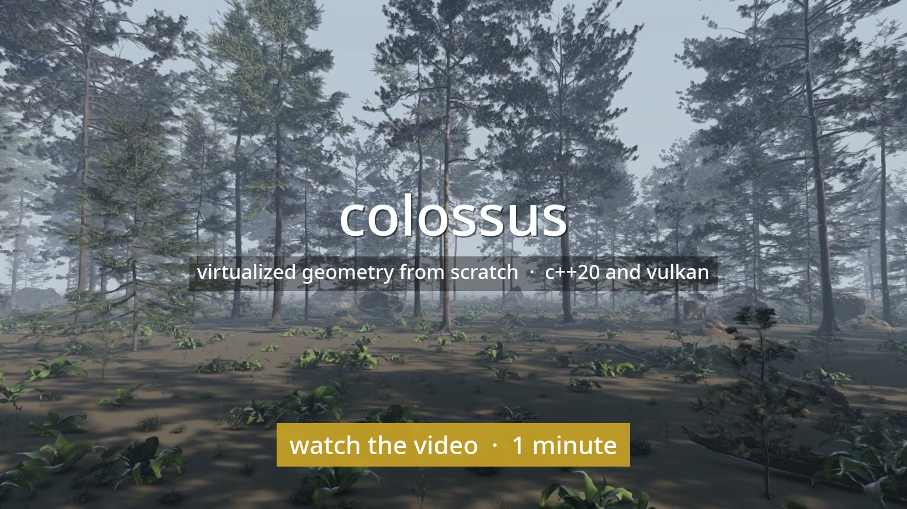

# colossus

[](https://github.com/apollo-2006/colossus/actions/workflows/ci.yml)
[](LICENSE)

hey! colossus is a virtualized geometry renderer I built from scratch in c++20 and vulkan.
it's the idea behind unreal engine 5's nanite: a builder turns a scanned model into a
crack-free hierarchy of triangle clusters, and a renderer streams it from disk and draws
thousands of copies, every cluster picking the coarsest detail that's still within a pixel
of the original. no engine underneath, just vulkan and glfw, so clustering,
simplification, streaming, culling, both rasterizers, shadows and shading all live right
here in this repo.

it started as a "let me actually understand nanite" side project that I didn't even plan
to put on github, and then I got a little obsessed. the thing I cared about most is making
"within a pixel" a real, proven bound instead of an estimate, and checking that it holds.

I'd been prototyping it locally since february 2026, outside of git, so the commit
history here only starts in october, when I moved it into a repo and got it ready to
publish.

**[fly through it in your browser →](https://apollo-2006.github.io/colossus/)** the
webgpu port, with the debug views, the error threshold and the crowd size to play with
(needs a desktop gpu).

[](https://apollo-2006.github.io/colossus/colossus.mp4)


900 copies of lucy (28 million triangles) and the xyz rgb dragon (7.2 million): that's 15.9
billion triangles at full detail, drawn at 1920x1080 in 1.51 ms on my rx 9070 xt, with soft
shadows, bounce light, ambient occlusion and antialiasing. only about 4.8 million triangles
actually reach the screen, from about 20 mb of the 427 mb on disk. a million instances
(17.6 trillion triangles) take 1.78 ms.

## how it works

the short version:

* **a hierarchy of clusters.** every model gets cut into clusters of at most 128
  triangles by recursively bisecting its triangle graph (an earlier greedy approach kept
  leaving half-empty clusters; bisection fills them). groups of about eight get merged and
  simplified to half, with the vertices they share with other groups locked in place, so
  any mix of levels still meets edge for edge. that repeats level after level until one
  small root is left (`src/cluster.cpp`, `src/dag.cpp`, `src/simplify.cpp`).
* **errors that are proven.** this is the part I'm proudest of. each group's error is an
  upper bound on how far it can be from what it replaced, not an estimate
  (`src/deviation.cpp`), and the way it's projected onto the screen is bounded too. errors
  only grow toward the root, so one comparison per cluster,
  `own error on screen <= 1 pixel < parent error on screen`, picks exactly one level on
  every path. one gpu thread per cluster, no tree to walk.
* **checked, not trusted.** every level reuses the original vertices, so a crack is easy to
  spot exactly. `--check` tests 25 cuts, and every model here comes out with none.
  `docs/quality.py` measures what the bound means in actual pixels (more below).
* **culling.** cells of instances, then instances, then clusters, each tested against the
  view and last frame's depth, with a second pass to catch anything newly visible.
* **two rasterizers.** clusters bigger than 32 pixels go to mesh shaders, smaller ones to
  a compute rasterizer (pixel-sized triangles are what hardware handles worst), both
  writing into one 64-bit visibility buffer. compute triangles grow by 1/256 of a pixel so
  the seams between the two stay watertight. (that one was a fun bug to find.)
* **streaming.** only bounds and errors stay in memory, 48 bytes a cluster. everything else
  lives in bit-packed pages that stream into a fixed pool on eight threads, and a page is
  only ever resident while its coarser stand-ins are, so whatever has loaded, every path
  draws exactly one cluster.
* **shading.** each pixel looks its triangle back up for exact barycentrics. there are
  virtual shadow maps (a 14 level clipmap drawn from the same hierarchy), gtao ambient
  occlusion, a bounce of indirect light, taa, and procedural marble, sandstone, granite,
  gold and bronze for the scans that come without textures.
* **real content.** textures stream as tiles through the same pool. skinned gltf models
  play their animations, with errors measured in their poses (the proof stops working once
  things bend, so that part is measured, not proven). foliage was its own adventure:
  thousands of needles that normal simplification won't delete, so it falls back to vertex
  clustering, grows what's left back to the area it lost, and counts lost area in its
  error so crowns stay full at a distance. gltf normal and roughness maps shade the detail.

if you like numbers, the commit messages have every step's before and after.


poly haven's cc0 pine forest (`python3 models/forest.py`): 55 models scattered into 14,780
instances, 753 million triangles at full detail. 113 million get drawn, in 7.49 ms at
1920x1080, with poly haven's normal and roughness maps.


horatio greenough's george washington (1840), scanned by the smithsonian american art
museum: 17 million triangles and a 4096x4096 texture, streamed in tiles. 0.80 ms.


900 khronos foxes, each subdivided to 590 thousand triangles, walking, running and looking
around: 1.73 ms.


lod levels (view 4): the nearby dragons draw mid levels, the distant statues the coarsest,
and you can watch single statues mix levels as they recede.

## does "within a pixel" actually hold?

a proof about distances isn't a statement about pixels yet, so I measured it.
`docs/quality.py` renders five views at a threshold of 0.05 pixels (full detail, near
enough) and at the threshold being tested, with every source of frame-to-frame noise
turned off. a coverage view checks how far each pixel that changed lies from the
full-detail silhouette, and nvidia's [flip](https://github.com/NVlabs/flip) compares the
shaded images.

| view | full detail | at 1 px | coverage differs | farthest from silhouette | flip | pixels off by over 8/255 |
|---|---|---|---|---|---|---|
| lucy, close | 6.21m | 374.1k | 0.011% | 1.41 px | 0.0119 | 1.06% |
| dragon, whole | 3.72m | 273.9k | 0.007% | 0.00 px | 0.0044 | 0.68% |
| washington, face | 2.18m | 313.5k | 0.010% | 0.00 px | 0.0088 | 0.59% |
| fox, walking | 554.0k | 62.3k | 0.001% | 0.00 px | 0.0003 | 0.03% |
| crowd of nine | 21.66m | 1.10m | 0.020% | 1.41 px | 0.0096 | 1.77% |

it does: at one pixel, every pixel whose coverage changes touches the full-detail
silhouette, at most a diagonal step away. what's left over is shading, since a coarse
triangle blends its normals over a bigger area and the bound says nothing about normals.

foliage taught me the bound wasn't the whole story, though. a crown with half its needles
gone is still "close" to every needle that's left, so a pure distance bound happily lets a
tree go see-through. so for foliage the error also counts the area a simplification lost
(half its square root: a cut at t pixels loses about (2t)² pixels of coverage per group),
and clustered pieces grow back the area of what merged into them. one pine at 1 px,
triangles and how much of its full-detail coverage it keeps:

| pine at | without | counting half the lost area | counting all of it |
|---|---|---|---|
| 50 m | 2.52m, 0.972 | 2.94m, 0.981 | 3.93m, 0.989 |
| 200 m | 730k, 0.882 | 1.01m, 0.912 | 1.86m, 0.951 |
| 400 m | 346k, 0.916 | 425k, 0.932 | 980k, 0.963 |

half (the default) keeps most of the gain for 1.2 to 1.4 times the triangles. the whole
forest draws 113 million where it used to draw 90.

## against meshoptimizer

I wanted an honest yardstick, so `docs/compare` builds lucy and the dragon with
meshoptimizer's [clusterlod](https://github.com/zeux/meshoptimizer/blob/master/demo/clusterlod.h),
the reference nanite-style builder a lot of people use, at its own defaults, converts the
result into colossus's format, and measures both through the same renderer. only the
builder changes (`make compare`, then `python3 docs/compare/compare.py`).

| view | builder | threshold | triangles | coverage differs | farthest from silhouette | flip |
|---|---|---|---|---|---|---|
| lucy, close | colossus | 1 px | 374.1k | 0.011% | 1.41 px | 0.0119 |
| lucy, close | clusterlod | 0.5 px | 365.0k | 0.012% | 1.41 px | 0.0097 |
| dragon, whole | colossus | 1 px | 273.9k | 0.007% | 0.00 px | 0.0044 |
| dragon, whole | clusterlod | 0.5 px | 240.9k | 0.012% | 0.00 px | 0.0038 |
| crowd of nine | colossus | 2 px | 518.6k | 0.038% | 0.00 px | 0.0129 |
| crowd of nine | clusterlod | 1 px | 462.3k | 0.068% | 1.41 px | 0.0124 |
| crowd of nine | colossus | 4 px | 235.5k | 0.076% | 2.24 px | 0.0178 |
| crowd of nine | clusterlod | 2 px | 230.9k | 0.132% | 8.00 px | 0.0167 |

the result was more interesting than "mine wins". at about the same number of triangles,
clusterlod shades as well or better, and colossus keeps silhouettes tighter: half the
coverage change or less, and never more than 2.24 px out where clusterlod's stray 8 to 9.
the thresholds mean different things too: clusterlod's is an estimate, and its 1 px draws
about what colossus's 2 to 4 px does. a triangle costs the same through the same renderer,
so the crowd at 1 px is 1.54 ms against 1.42 (measured the same day), which is basically
the price of the guarantee. and clusterlod builds 1.6 to 3.4 times faster (lucy in 78 s
against 264) with files 4% smaller, so that one's all theirs.

pricing collapses by the change of normal too (`--normal-weight 1`) closes some of the
shading gap, flip 5 to 10% lower at equal triangles, but each pixel of threshold then takes
more triangles, so it's off by default.

## performance

all of this is on my rx 9070 xt (radv, mesa 26.2.4) at 1920x1080, the median of 200 frames
once the pages settle. shading includes shadows and antialiasing. `docs/bench.sh` measures
the whole table, so you can run it on your own gpu.

| scene | frame | culling | raster | pass 2 | shadow pages | shading | triangles |
|---|---|---|---|---|---|---|---|
| 900 statues, beside lucy (top image) | 1.51 ms | 0.17 | 0.27 | 0.10 | 0.08 | 0.89 | 4.78m |
| 900 statues, raised (lod image) | 1.70 ms | 0.11 | 0.38 | 0.09 | 0.08 | 1.04 | 7.37m |
| 900 statues, ground level | 1.40 ms | 0.15 | 0.23 | 0.10 | 0.08 | 0.84 | 3.83m |
| a million statues | 1.78 ms | 0.24 | 0.47 | 0.22 | 0.07 | 0.78 | 13.0m |
| a million, 1% moving | 1.95 ms | 0.23 | 0.41 | 0.23 | 0.37 | 0.71 | 13.4m |
| washington, close | 0.80 ms | 0.10 | 0.06 | 0.08 | 0.05 | 0.51 | 357k |
| 900 skinned foxes | 1.73 ms | 0.14 | 0.34 | 0.08 | 0.70 | 0.46 | 4.59m |
| the forest | 7.49 ms | 0.93 | 4.95 | 0.33 | 0.06 | 1.22 | 113m |

in chrome (webgpu), the 900 statues take 1.73 ms of gpu time. the forest is the heavy one,
and it turns out its raster is bound by traffic to the visibility buffer, not by its
triangles: with the writes taken out it gets through 364 million triangles in 1.33 ms.
the obvious fix, resolving each cluster in shared memory first, was slower at every tile
size I tried (64-bit shared atomics and lost occupancy cost more than the traffic they
saved), so that one's still open.

## in the browser

`web/` is the same renderer in webgpu. webgpu has no mesh shaders, 64-bit atomics or ray
queries, so big clusters use a plain render pipeline, the compute rasterizer runs twice
(depth first, then the triangle wherever its depth won), and pages stream over http range
requests. it needs 16 storage buffers per shader stage, which desktop gpus have; anything
else (like most phones) gets a webgl2 fallback (`web/lite.js`) that runs the same lod test
on the cpu for one model. `?still` holds the camera still and `?fallback` shows the
fallback anywhere. `web/build.sh` builds its models.

## build & run

you'll need a gpu with vulkan 1.3 and `VK_EXT_mesh_shader`, the vulkan headers and loader,
glfw and `glslc`. ray queries are optional, only `--shadows rt` and `--gi rt` use them.

```bash
git clone https://github.com/apollo-2006/colossus.git
cd colossus
make
models/fetch.sh            # downloads lucy and the dragon (380 mb) and builds both
models/fetch.sh washington # the textured scan (720 mb, needs ffmpeg for its texture)
models/fetch.sh fox        # the skinned fox (a small gltf, subdivided when built)

./colossus --model models/lucy.cgeo --model models/xyzrgb_dragon.cgeo --grid 30
./colossus --model models/lucy.cgeo                       # one lucy
./colossus --model models/lucy.cgeo --model models/xyzrgb_dragon.cgeo --grid 1000 --moving 0.01
./colossus --model models/lucy.cgeo --materials bronze    # one lucy, in bronze
./colossus --model models/washington.cgeo                 # textured
./colossus --model models/fox.cgeo --grid 30 --spacing 1.2 # 900 foxes, each animation
python3 models/forest.py                                  # the forest (2.2 gb download, 2 gb built)
./colossus --scene models/forest.scene                    # walk through it
./colossus_build any.ply out.cgeo --check                 # your own model, checked for cracks
```

| keys | |
|---|---|
| w a s d, q e | move, down and up; drag to look; scroll for speed, shift to hurry |
| 1 to 9, 0 | shaded, clusters, triangles, lod level, groups, instances, holes, rasterizer, shadow levels, ambient occlusion |
| [ and ] | halve or double the error threshold (1 pixel) |
| f | freeze culling, then fly out and watch it (my favourite one) |
| c v o r h x | cone culling, frustum culling, occlusion, compute rasterizer, shadows, antialiasing |
| j g b i | soft shadows, ambient occlusion, bounce light, traced bounce light (`--gi rt`) |
| t, p | wireframe; print the camera as a `--camera` argument |

`--headless --frames n --screenshot out.png` renders without a window and prints the
median frame's timings. `docs/shots.sh` renders the images on this page.

## tests

`make test` needs no gpu or downloads. `tests/builder_test.cpp` builds full hierarchies
(closed, holed, flat, textured, multi-material, skinned, and a pile of foliage islands) and
crack-checks them at 31 cuts, round-trips the page format exactly, checks the proven error
against brute force on about 94,000 random points, and checks the texture formats and
truncated files. fun fact: without the group locks, it finds 39,095 cracked edges on the
test sphere alone. `tests/streamer_test.cpp` throws 3,000 frames of random requests at a
small pool, checking every frame that resident pages' dependencies are resident. ci runs
both and builds the viewer on every push, and the demo only publishes once every model
draws in a real browser.

## what it doesn't do (yet)

* the bound is proven for geometry, not shading: a normal or a shadow can still shift by
  more than a pixel's worth where they depend on detail the cut removed.
* proving bounds makes building slow: 4.4 minutes for lucy.
* skinning is linear blend, with errors measured over the shipped animations rather than
  proven. moving and animated instances are expensive in the shadow maps, which redraw their
  pages every frame (a million foxes: 7.29 ms, 4.10 of it shadows).
* at equal triangles meshoptimizer shades better: colossus's error is a distance, so its
  cuts spend triangles on silhouettes. pricing collapses by normals didn't change that, even
  with hoppe's attribute quadrics; making shading part of the error would, but that's a
  different promise.
* textures have no alpha, so a card meant as a cutout draws as its whole quad. the browser
  only takes one material's colour.
* foliage is the most expensive thing here: keeping crowns full, the forest draws 113
  million triangles where 900 statues draw 4.8, and it's bound by visibility-buffer
  traffic. coverage is measured as area, which overlapping needles overstate. a scene whose
  pages outgrow the pool thrashes, so scene files can ask for a bigger pool.
* every number here comes from one gpu, my rx 9070 xt on radv. nvidia and intel are next.

## models (and thanks)

lucy and the xyz rgb asian dragon come from the
[stanford 3d scanning repository](http://graphics.stanford.edu/data/3Dscanrep/), with
thanks to the stanford computer graphics laboratory (and xyz rgb inc. for the dragon).
they aren't redistributed here; `models/fetch.sh` downloads them. horatio greenough's
george washington is the [smithsonian american art museum](https://americanart.si.edu)'s
scan, released cc0 through [smithsonian open access](https://3d.si.edu). the fox is from
the [khronos gltf sample assets](https://github.com/KhronosGroup/glTF-Sample-Assets): model
by pixelmannen (cc0), rigging and animation by tomkranis (cc by 4.0), gltf conversion by
asobostudio and scurest (cc by 4.0). the forest is [poly haven](https://polyhaven.com)'s
pine forest collection (cc0), downloaded by `models/forest.py`.

and a big thank you to brian karis, rune stubbe and graham wihlidal for the nanite talks
that started all of this, and to arseny kapoulkine for meshoptimizer, which was my
reference the whole way through.
