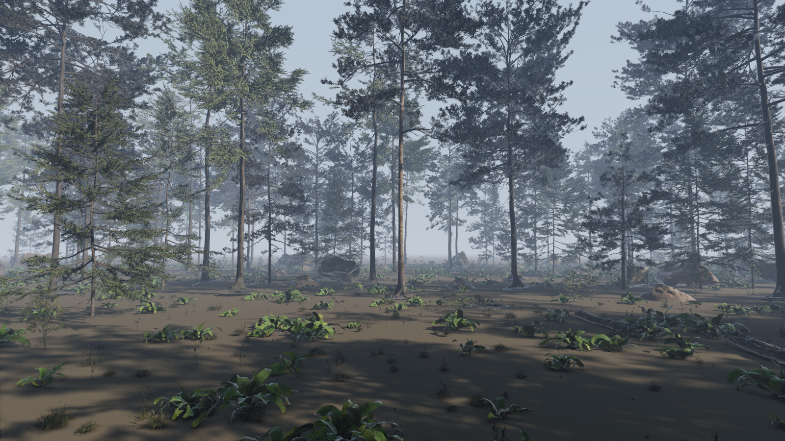
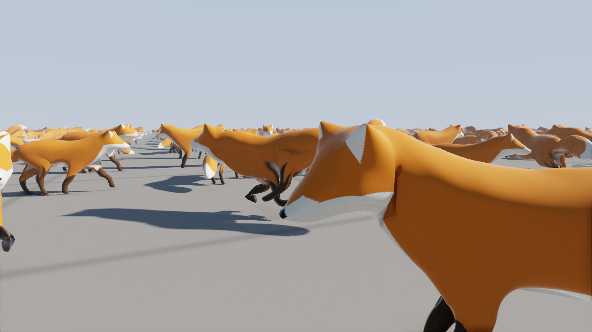

# colossus

[](https://github.com/apollo-2006/colossus/actions/workflows/ci.yml)
[](LICENSE)

virtualized geometry from scratch, in c++20 and vulkan. a builder turns a scanned model
into a crack-free hierarchy of clusters; a renderer streams it from disk and draws
thousands of copies, picking per cluster the coarsest detail within a pixel of the
original. it's the idea behind unreal engine 5's nanite, built here with nothing but
vulkan and glfw: clustering, simplification, streaming, culling, both rasterizers,
shadows and shading all live in this repository.

**[fly through it in your browser →](https://apollo-2006.github.io/colossus/)** the
webgpu port, with the debug views, the error threshold and the crowd size to play with.

**[read how it was built →](https://abirdeol.tech/abir-deol-colossus-within-a-pixel.pdf)**
*within a pixel*, a 9 page write-up: the hierarchy, the proven error bound and how it's
checked, streaming, textures, skinning, foliage, and where the proofs ran out.


900 instances of lucy (28 million triangles) and the xyz rgb dragon (7.2 million): 15.9
billion triangles at full detail, drawn at 1920x1080 in 1.48 ms on an rx 9070 xt with
soft shadows, bounce light, ambient occlusion and antialiasing. about 4.8 million
triangles reach the screen, from about 20 mb of the 427 mb on disk. a million instances
(17.6 trillion triangles) take 1.81 ms.

## how it works

the [paper](https://abirdeol.tech/abir-deol-colossus-within-a-pixel.pdf) has the whole
story; in short:

* **a hierarchy of clusters.** clusters of at most 128 triangles, by recursive bisection
  of the triangle graph. groups of about eight are merged and simplified to half with the
  vertices they share with other groups locked, so any mix of levels meets edge for edge,
  level after level up to one small root (`src/cluster.cpp`, `src/dag.cpp`,
  `src/simplify.cpp`).
* **errors that are proven.** each group's error is an upper bound on the two-sided
  distance from what it replaced, not an estimate (`src/deviation.cpp`), and its
  projection to the screen is bounded too. errors only grow toward the root, so
  `own error on screen <= 1 pixel < parent error on screen` picks exactly one level on
  every path: one gpu thread per cluster, no tree to walk.
* **checked, not trusted.** every level indexes the original vertices, so a crack is
  exact; `--check` tests 25 cuts and every model here has none. `docs/quality.py`
  measures the bound in pixels (below).
* **culling.** cells of instances, then instances, then clusters, each against the
  frustum and last frame's depth pyramid, with a second pass for anything newly visible.
* **two rasterizers.** clusters over 32 pixels go to mesh shaders, smaller ones to a
  compute rasterizer, both into one 64-bit visibility buffer. compute triangles grow by
  1/256 of a pixel so the seams between the two stay watertight.
* **streaming.** only bounds and errors stay resident, 48 bytes a cluster. bit-packed
  pages load into a fixed pool on eight threads, and a page is resident only while its
  coarser stand-ins are, so exactly one cluster draws on every path whatever has loaded.
* **shading.** each pixel refetches its triangle for exact barycentrics. virtual shadow
  maps (a 14 level clipmap drawn from the same hierarchy), gtao ambient occlusion, a
  bounce of indirect light, taa, and procedural marble, sandstone, granite, gold and
  bronze for scans with no uvs.
* **real content.** textures stream as tiles through the same pool, wedges carrying
  coordinates and materials through simplification. skinned gltf models play their
  animations, errors measured in their poses. foliage, thousands of needles that edge
  collapse won't delete, falls back to vertex clustering that keeps outlines whole.

the commit messages have every step's numbers.



poly haven's cc0 pine forest (`python3 models/forest.py`): 55 models scattered into 14,780
instances, 753 million triangles at full detail, 89.8 million drawn in 5.63 ms at
1920x1080.


horatio greenough's george washington (1840), the smithsonian american art museum's scan:
17 million triangles and a 4096x4096 texture, streamed in tiles. 1.04 ms.



900 khronos foxes, subdivided to 590 thousand triangles each, walking, running and looking
round: 1.86 ms.


lod levels (view 4): near dragons draw mid levels, distant statues the coarsest, and
single instances mix levels as they recede.

## quality

`docs/quality.py` renders five views at a threshold of 0.05 pixels (full detail, near
enough) and at the threshold under test, with every source of frame-to-frame noise off.
a coverage view measures how far each pixel whose coverage changed lies from the
full-detail silhouette; nvidia's [flip](https://github.com/NVlabs/flip) compares the
shaded images.

| view | full detail | at 1 px | coverage differs | farthest from silhouette | flip | pixels off by over 8/255 |
|---|---|---|---|---|---|---|
| lucy, close | 6.21m | 374.1k | 0.011% | 1.41 px | 0.0119 | 1.06% |
| dragon, whole | 3.72m | 273.9k | 0.007% | 0.00 px | 0.0044 | 0.68% |
| washington, face | 2.18m | 313.5k | 0.010% | 0.00 px | 0.0088 | 0.59% |
| fox, walking | 554.0k | 62.3k | 0.001% | 0.00 px | 0.0003 | 0.03% |
| crowd of nine | 21.66m | 1.10m | 0.020% | 1.41 px | 0.0096 | 1.77% |

at one pixel every pixel whose coverage changes touches the full-detail silhouette, at
most a diagonal step from it. what's left is shading: a coarse triangle interpolates
normals over a larger span, and the bound says nothing about normals.

## performance

rx 9070 xt (radv, mesa 26.2.4), 1920x1080, the 900 instance scene, median of 200 frames
after 100 of streaming. shading includes shadows and antialiasing.

| camera | frame | culling | raster | pass 2 | shadow pages | shading | triangles |
|---|---|---|---|---|---|---|---|
| beside lucy (top image) | 1.48 ms | 0.17 | 0.26 | 0.10 | 0.08 | 0.88 | 4.77m |
| raised (lod image) | 1.67 ms | 0.11 | 0.36 | 0.09 | 0.08 | 1.03 | 7.44m |
| ground level | 1.37 ms | 0.14 | 0.22 | 0.10 | 0.07 | 0.83 | 3.86m |

| scene | frame |
|---|---|
| a million instances | 1.81 ms |
| a million, 1% moving | 2.01 ms |
| 900 skinned foxes | 1.86 ms |
| the forest | 5.63 ms |
| in chrome (webgpu), 900 statues | 1.73 ms |

## in the browser

`web/` is the same renderer in webgpu, which has no mesh shaders, 64-bit atomics or ray
queries: big clusters use a plain render pipeline, the compute rasterizer runs twice
(depth, then the triangle where its depth won), and pages stream over http range
requests. it needs 16 storage buffers per shader stage, which desktop gpus allow; anything
else gets a webgl2 fallback (`web/lite.js`) that runs the same lod test on the cpu for
one model. `?still` holds the camera, `?fallback` shows the fallback anywhere.
`web/build.sh` builds its models.

## build & run

you'll need a gpu with vulkan 1.3 and `VK_EXT_mesh_shader`, the vulkan headers and
loader, glfw and `glslc`. ray queries are optional, only `--shadows rt` and `--gi rt`
use them.

```bash
git clone https://github.com/apollo-2006/colossus.git
cd colossus
make
models/fetch.sh            # downloads lucy and the dragon (380 mb) and builds both
models/fetch.sh washington # the textured scan (720 mb, needs ffmpeg for its texture)
models/fetch.sh fox        # the skinned fox (a small gltf, subdivided when built)

./colossus --model models/lucy.cgeo --model models/xyzrgb_dragon.cgeo --grid 30
./colossus --model models/lucy.cgeo                       # one lucy
./colossus --model models/lucy.cgeo --model models/xyzrgb_dragon.cgeo --grid 1000 --moving 0.01
./colossus --model models/lucy.cgeo --materials bronze    # one lucy, in bronze
./colossus --model models/washington.cgeo                 # textured
./colossus --model models/fox.cgeo --grid 30 --spacing 1.2 # 900 foxes, each animation
python3 models/forest.py                                  # the forest (2.2 gb download, 2 gb built)
./colossus --scene models/forest.scene                    # walk through it
./colossus_build any.ply out.cgeo --check                 # your own model, checked for cracks
```

| keys | |
|---|---|
| w a s d, q e | move, down and up; drag to look; scroll for speed, shift to hurry |
| 1 to 9, 0 | shaded, clusters, triangles, lod level, groups, instances, holes, rasterizer, shadow levels, ambient occlusion |
| [ and ] | halve or double the error threshold (1 pixel) |
| f | freeze culling, then fly out and watch it |
| c v o r h x | cone culling, frustum culling, occlusion, compute rasterizer, shadows, antialiasing |
| j g b i | soft shadows, ambient occlusion, bounce light, traced bounce light (`--gi rt`) |
| t, p | wireframe; print the camera as a `--camera` argument |

`--headless --frames n --screenshot out.png` renders without a window and prints the
median frame's timings. `docs/shots.sh` renders the images on this page.

## tests

`make test` needs no gpu or downloads. `tests/builder_test.cpp` builds full hierarchies
(closed, holed, flat, textured, multi-material, skinned, and a foliage of islands) and
crack-checks them at 31 cuts, round-trips the page format exactly, checks the proven
error against brute force on about 94,000 random points, and checks bc1 tiles and
truncated files. without the group locks it finds 39,095 cracked edges on the sphere
alone. `tests/streamer_test.cpp` runs 3,000 frames of random requests into a small pool,
checking every frame that resident pages' dependencies are resident. ci runs both and
builds the viewer on every push.

## limitations

* the bound is proven for geometry, not shading: a normal or a shadow can shift by more
  than a pixel's worth where they depend on detail the cut removed.
* proving bounds makes building slow: 4.4 minutes for lucy.
* skinning is linear blend, its errors measured over the shipped animations, not proven.
  moving and animated instances are expensive in the shadow maps, which redraw their
  pages every frame (a million foxes: 8.77 ms, 4.32 of it shadows).
* textures are colour only, with no alpha: a card meant as a cutout draws as its whole
  quad. the browser takes one texture per model.
* foliage simplifies by vertex clustering, which thins crowns at a distance, and costs the
  most of anything here: the forest draws 90 million triangles where 900 statues draw 4.8.
  a scene whose pages outgrow the pool thrashes (the forest in 1 gb: 24.6 ms instead of
  5.6), so scene files can ask for a bigger pool.
* every number here is from one gpu, an rx 9070 xt on radv.

## models

lucy and the xyz rgb asian dragon come from the
[stanford 3d scanning repository](http://graphics.stanford.edu/data/3Dscanrep/), with
thanks to the stanford computer graphics laboratory (and xyz rgb inc. for the dragon).
they aren't redistributed here; `models/fetch.sh` downloads them. horatio greenough's
george washington is the [smithsonian american art museum](https://americanart.si.edu)'s
scan, released cc0 through [smithsonian open access](https://3d.si.edu). the fox is from
the [khronos gltf sample assets](https://github.com/KhronosGroup/glTF-Sample-Assets): model
by pixelmannen (cc0), rigging and animation by tomkranis (cc by 4.0), gltf conversion by
asobostudio and scurest (cc by 4.0). the forest is [poly haven](https://polyhaven.com)'s
pine forest collection (cc0), downloaded by `models/forest.py`.
