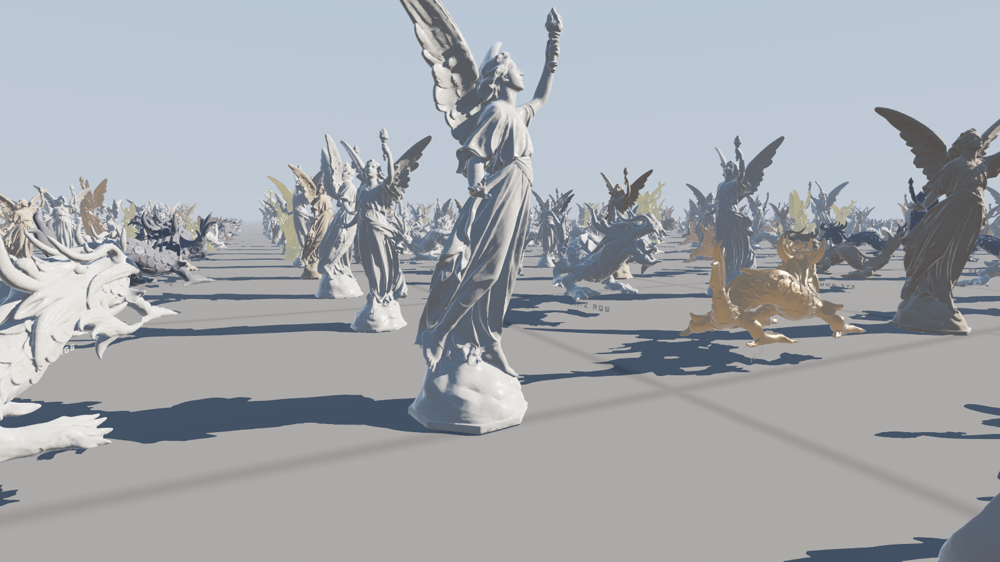
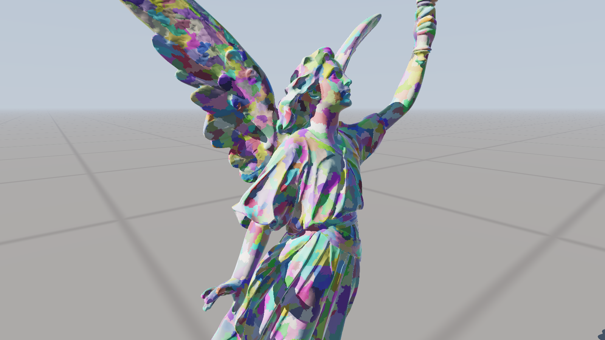
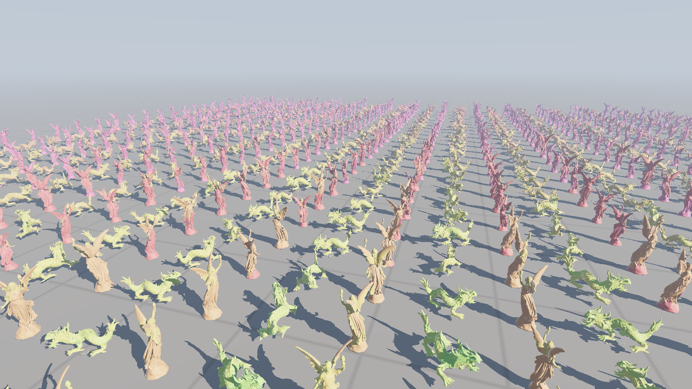
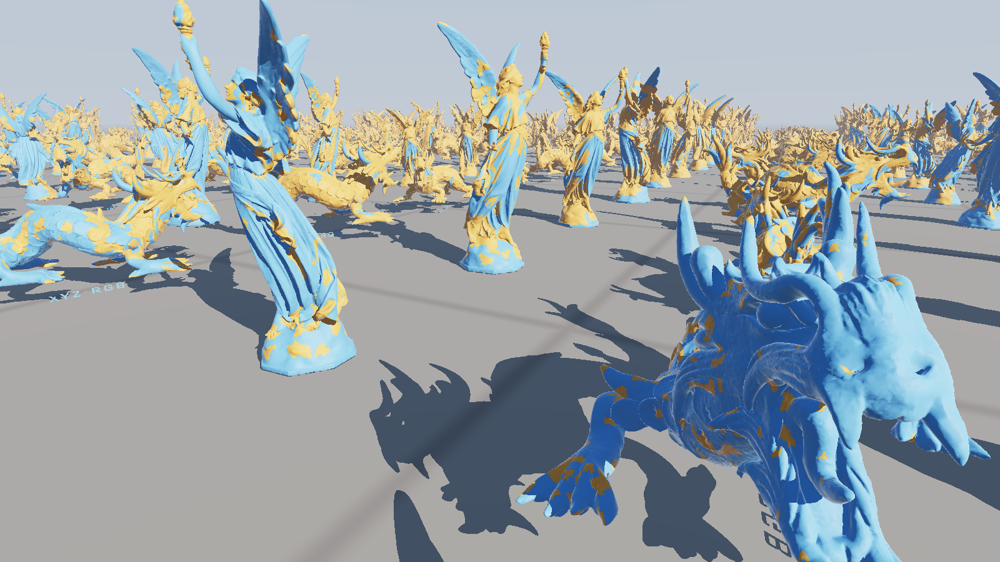

# colossus

[](https://github.com/apollo-2006/colossus/actions/workflows/ci.yml)
[](LICENSE)

Virtualized geometry from scratch, in C++20 and Vulkan: a builder that turns a scanned
model into a crack-free hierarchy of clusters, and a renderer that streams it from disk
and draws thousands of copies of it by picking, cluster by cluster, the coarsest detail
that stays within a pixel of the original. It is the technique behind Unreal Engine 5's
Nanite, written with no libraries beyond Vulkan and GLFW: the clustering, the
simplifier, the graph partitioning, the streaming, the culling, both rasterizers and the
shading are all in this repository.

**[Fly through it in your browser →](https://apollo-2006.github.io/colossus/)** A
WebGPU port of the renderer (see [In the browser](#in-the-browser)), streaming its
pages over HTTP, with the debug views, the error threshold and the crowd size to play
with.



900 instances of Lucy (28M triangles) and the XYZ RGB dragon (7.2M), 15.9 billion
triangles at full detail, drawn at 1920x1080 in 0.84 ms on an RX 9070 XT, shadows and
antialiasing included. About 3M triangles reach the screen, from 23 MB of the 579 MB
on disk. A million instances (17.6 trillion triangles) take 1.32 ms, and instances
can move.

## How it works

### Building the hierarchy (`colossus_build`)

* **Clusters.** The mesh is split into clusters of at most 128 triangles and 128
  vertices (`src/cluster.cpp`), the unit every later step works in, by recursive
  bisection of the graph of triangles that share an edge. Each piece is cut in two
  from two seeds far apart, growing outward from each in breadth-first layers, with
  the cut placed so both halves hold a whole number of clusters; a few passes of
  swapping triangles across the cut then shorten it. Every cluster comes out full:
  the dragon's 7.2M triangles make 56,404 leaf clusters, 128.0 triangles on average.
  The greedy grower this replaced left 8% of clusters as small pockets walled in by
  full ones.
* **Groups, locked, then simplified.** Each level's clusters are partitioned into
  groups of about eight that share the most edges (`src/dag.cpp`). Every vertex a
  group shares with another group is locked, the group's triangles are merged and
  simplified to half, and the result is split into new clusters: the next level.
  Because group outlines never move, a simplified group meets an unsimplified
  neighbour edge for edge. The next level's groups fall differently, so a border
  locked at one level is free at the next, and no seam lasts more than a level.
* **Quadric simplification.** `src/simplify.cpp` collapses edges cheapest first by
  quadric error (Garland and Heckbert): each vertex carries the summed squared
  distances to the planes around it. Collapses keep one endpoint, so every level
  indexes the original vertices and the whole hierarchy shares one vertex buffer.
  Collapses that would flip a triangle, pinch the surface (the link condition) or
  remove a vertex's last triangles are refused, and a vertex on a hole in the scan
  may only slide along the hole's edge.
* **Errors that are measured, and only grow.** A quadric's cost is a mean over
  planes, so it can understate the worst spot. Each simplified group is instead
  measured against what it replaced: a two-sided distance sampled at every vertex,
  edge midpoint and triangle centre of each surface, from the nearest triangle of the
  other through a grid. The group's error is its children's plus the larger of that
  and the quadric's estimate. Where the measurement comes out over four times the
  estimate, the group is simplified again, less far, and the better result kept.
  A cluster stores its own error and its parent group's, each with a bounding sphere,
  and both only grow toward the root. So the test
  `own error on screen <= 1 pixel < parent error on screen` picks exactly one level
  along every path from a leaf to a root, and every cluster of a group agrees. Each
  cluster is tested on its own, by its own GPU thread, with no tree to walk.
* **Checked for cracks.** Since every level uses the original vertices, a crack is
  exact to detect: an edge used by one triangle of a cut whose ends are not both on a
  hole in the scan. `colossus_build --check` selects 25 cuts across the error range and
  counts them. Lucy builds 23 levels in 84 s and the dragon 21 levels in 21 s, every
  cut with 0 cracked edges.
* **One small root.** Near the top, a model's last group is thin parts and hole rims,
  and edge collapses that keep the topology run out: Lucy used to stop at three roots
  of 313 triangles. Nothing borders the last group, so there vertex clustering takes
  over: one original vertex per cell of a grid, the grid made coarser until the count
  halves. Duplicate triangles are kept, so every edge keeps the parity of its use
  count, and a cell with a hole vertex keeps one, so the crack check still holds.
  Lucy now ends in one root of 20 triangles and the dragon in one of 32.

### Drawing it (`colossus`)

1. **Instance culling.** Instances are placed in cells of 8x8 neighbours, and
   `cell_cull.comp` tests a sphere around each cell against the frustum and the depth
   pyramid before any of its instances is read. `instance_cull.comp` then takes the
   visible cells' instances, one per invocation: it drops those outside the view and,
   for the rest, finds which clusters could be drawn at all. Clusters are stored in
   order of parent error, and one can only be drawn while its parent looks too coarse,
   so a binary search skips every cluster fine enough anywhere on the instance. A far
   instance tests a short tail of its coarsest clusters, not all 445k. The workgroup
   writes its instances' work together after a prefix sum of their counts; a near
   instance, thousands of pieces of work, gets a workgroup of its own
   (`expand.comp`).
2. **Cluster culling** (`cluster_cull.comp`) tests the rest: the LOD cut, the
   frustum, the normal cone, and occlusion. Survivors are appended to a list with one
   atomic per subgroup. This began as a task shader; on RADV each task workgroup has a
   fixed cost, and testing 630k clusters took 1.13 ms that way and 0.39 ms as compute.
3. **Two rasterizers.** Clusters over 32 pixels on screen go to mesh shaders. Smaller
   ones go to `sw_raster.comp`, a compute rasterizer with an invocation per triangle,
   since their triangles cover a pixel or two and the hardware handles those poorly.
   Both write `depth << 32 | (cluster, triangle)` into one 64-bit visibility buffer
   with an atomic max, so they mix freely. The compute rasterizer snaps to 1/256 pixel
   like the hardware and follows a top-left fill rule, so where the two meet there are
   no gaps. Its edge functions are 32-bit, measured from each triangle's corner: RDNA
   has no 64-bit integer multiply, and the first, 64-bit version lost to the hardware
   at every size.
4. **Occlusion in two passes.** Pass 1 tests cells, instances and clusters against
   last frame's depth pyramid, from last frame's camera, and draws what it cannot
   prove hidden. A pyramid is built from what it drew, and pass 2 tests what pass 1
   rejected again, drawing anything this frame reveals. The pyramid is built from the
   visibility buffer, so both rasterizers count. A moving instance is tested where it
   was last frame, since that is where last frame's pyramid has it.
5. **Shading** (`shade.comp`) finds each pixel's triangle again, intersects the
   pixel's ray with it for exact barycentrics, and interpolates normals. Each instance
   is one of five materials (marble, sandstone, granite, bronze or gold), lit with
   Lambert diffuse and a GGX specular lobe.
6. **Shadows**, where the GPU has ray queries. Rays toward the sun are traced against
   coarser copies of each model, cut from its own hierarchy at 256k, 32k and 4k
   triangles and kept in one acceleration structure under three masks; each ray uses
   the coarsest copy whose error is under half a pixel where it starts, and starts
   that error above the surface. `shadow.comp` traces one ray per 2x2 pixels, and
   shading borrows that result where every neighbour at the pixel's distance agrees,
   and traces its own ray at shadow edges and silhouettes. Rays stop once they climb above
   the tallest model. Together these took the three views below from 0.40, 0.55 and
   0.48 ms of shading to 0.32, 0.44 and 0.37 ms, with 0.07% to 0.37% of pixels
   visibly different. Moving instances are in a second acceleration structure,
   refitted every frame (see Motion and scale).
7. **Antialiasing** (`taa.comp`). Each frame's projection is nudged by a sub-pixel
   offset, eight in turn, and each pixel is blended 10% into a history found by
   projecting the surface under it with last frame's camera, the nudge taken back
   out, so a still camera never resamples its history. The history is read through a
   Catmull-Rom filter so a moving camera does not blur it, and held to the colours of
   the pixel's 3x3 neighbourhood so nothing ghosts. A moving surface is reprojected
   through its instance's last transform. It costs 0.05 to 0.07 ms.
8. **Streaming.** Only the clusters' bounds and errors stay resident. Their geometry is
   packed into pages, one per group, and paged from disk into a fixed pool
   (`--pool-mb`, 1 GB by default) as the GPU asks for it. A cluster that is drawn but
   would rather be its finer clusters, whose page is missing, requests that page,
   with its error on screen as the priority. Two frames later `viewer/streamer.hpp`
   reads the requests and issues loads for the most wanted pages, evicting the least
   recently used ones when the pool is full. Loader threads read the pages; the render
   thread only issues loads and publishes the ones that have finished.

   What keeps a streamed cut whole: a cluster is drawn either when it is the right
   level, or when the finer clusters it stands for are not resident. That only works
   if those stand-ins are always there, so a page may only be resident while the
   pages of the coarser clusters its group was simplified into are. Loads are issued
   coarsest first and published in the order they were issued, however the reads
   finish; a page counts as a dependent from the moment its load is issued, and is
   evicted only when nothing resident or loading depends on it. Then along every path
   from leaf to root, exactly one cluster is drawn, whatever has been loaded.

   Each level used to take a round trip of a few frames. A request also says how far
   it is from good enough, and each level roughly halves the error, so the streamer
   prefetches the pages below a request, at half the priority a level, while the error
   would still be over the threshold. From a cold start, a close up of Lucy settles
   in 17 frames instead of 45, and the crowd above in 32 instead of 45.

   Pages are compact: a vertex is two words, its position snapped to a grid over the
   model and stored as 14-bit offsets from its cluster's corner, its normal
   octahedral at 11 + 11 bits, and a triangle is three bytes. A vertex shared by
   clusters snaps to the same grid point in each, so quantizing opens no cracks;
   Lucy's grid step is 3.3e-5 of her height. Her pages are 460 MB. A shared vertex is
   still stored once per cluster that uses it, but each is used by only 1.22 clusters
   on average, so indexing them would save little; zlib takes 20% off a page.

   The crowd above reads 23 MB and holds at most 2,577 pages, since every instance
   draws from the same pages. A 300 frame flight through the crowd with a 16 MB pool
   evicts 24,085 pages, and at frames 100, 200 and 300 its holes view shows exactly
   the empty pixels a 1 GB pool does: background between thin parts, no gaps. From a cold
   file cache, the render thread's worst frame in the streamer is 2.0 ms with loader
   threads, against 44 ms reading pages itself (`--sync-loads`).

### Motion and scale

`--moving F` sets a share of the instances moving: each turns on the spot and drifts
round a small circle. The motion is computed in the shaders from the time
(`animate()` in `common.glsl`), so a million moving instances cost no uploads, and
every read of an instance goes through it. Occlusion pass 1 and antialiasing use the
transform an instance had last frame. For shadows, the moving instances are kept in a
second top-level acceleration structure: `tlas.comp` writes their transforms and it is
refitted in place each frame. A refit on RADV costs by the size of the whole structure
(2.7k entries 0.25 ms, 270k entries 0.94 ms, however few moved), so the still
instances stay in a structure built once, and a shadow ray that misses it also tests
the moving one.

| instances | moving | frame | triangles |
|---|---|---|---|
| 900 | none | 0.84 ms | 3.0M |
| 900 | half | 1.12 ms | 3.1M |
| 90,000 | 1% | 1.31 ms | 6.5M |
| 90,000 | half | 1.72 ms | 6.5M |
| 1,000,000 | none | 1.32 ms | 8.9M |
| 1,000,000 | 1% | 1.73 ms | 9.8M |

The crowd view, 1920x1080. About 0.16 ms of the cost of motion is a refit's fixed cost,
paid even for nine moving instances. At a million instances occlusion culling is what
makes it work: without it the same view draws 72M triangles in 3.84 ms. Instance
culling used to give each instance a workgroup, and pass 2 dispatched one for every
instance in the scene; a million took 2.95 ms, most of it in culling.



Each cluster of Lucy in its own color (debug view 2).



LOD levels (view 4): the nearest dragons draw mid levels, distant statues the coarsest,
and single instances mix levels where they recede.



Which rasterizer drew each pixel (view 8): orange for the compute rasterizer, blue for
mesh shaders. Only the nearest surfaces are worth sending to the hardware.

## In the browser

`web/` is the renderer ported to WebGPU, which has no mesh shaders, no 64-bit atomics,
no ray queries and no push constants:

* Large clusters go through an ordinary render pipeline: one instance per visible
  cluster, 384 vertices each, every vertex pulling its cluster, triangle and corner
  from storage buffers.
* The compute rasterizer cannot write depth and triangle in one atomic, so it runs
  twice: a 32-bit atomic max keeps the nearest depth, then a second pass writes the
  triangle wherever its depth won. Shading takes the nearer of the two rasterizers'
  results at each pixel.
* Pages stream over HTTP range requests, through a JavaScript port of the streamer
  (`web/streamer.js`), with the same dependency rules. A server that ignores ranges
  gets the whole page file fetched once.
* Occlusion culling runs in the same two passes, the pass number coming from a
  uniform buffer bound at a different offset per dispatch.
* Shadows come from a 2048x2048 shadow map over the ground in front of the camera,
  its casters picked by a second run of the same culling with an orthographic
  camera, at an error of 8 texels. Materials and antialiasing are the viewer's.
* A quarter of the crowd moves, as in the viewer, and instances are culled one per
  invocation with the same prefix sum and expansion; there are no cells, the demo
  being at its storage buffer budget. The crowd slider goes to a million.

The models are trimmed to 4M triangles at their finest (`colossus_build --max-triangles`,
which keeps the hierarchy above that cut intact): about 4 MB of gzipped metadata each,
loaded up front, and about 71 MB of pages, streamed. In Chrome on the RX 9070 XT at
1600x813, 900 instances (3.6 billion triangles at full detail) take 0.73 ms of GPU
time, drawing 2.2M triangles from 5 MB of pages, and a million (4 trillion) take
1.19 ms. It needs 14 storage buffers per shader stage, which
desktop GPUs allow. `web/build.sh` builds the models, and
`node tests/web_screenshot.mjs` renders the page in a headless Chrome.

## Build & run

Needs a GPU with Vulkan 1.3 and `VK_EXT_mesh_shader`, the Vulkan headers and loader,
GLFW, and `glslc`. Ray queries are optional: without them the viewer draws no shadows.

```bash
git clone https://github.com/apollo-2006/colossus.git
cd colossus
make
models/fetch.sh            # downloads Lucy and the dragon (380 MB) and builds both

./colossus --model models/lucy.cgeo --model models/xyzrgb_dragon.cgeo --grid 30
./colossus --model models/lucy.cgeo                       # one Lucy
./colossus --model models/lucy.cgeo --model models/xyzrgb_dragon.cgeo --grid 1000 --moving 0.01
./colossus_build any.ply out.cgeo --check                       # your own model, checked for cracks
```

| keys | |
|---|---|
| WASD, Q E | move, down and up; drag to look; scroll for speed, shift to hurry |
| 1 to 8 | shaded, clusters, triangles, LOD level, groups, instances, holes, rasterizer |
| [ and ] | halve or double the error threshold (1 pixel) |
| F | freeze culling, to fly out and watch it from outside |
| C V O R H X | cone culling, frustum culling, occlusion, compute rasterizer, shadows, antialiasing |
| T, P | wireframe; print the camera as a `--camera` argument |

`--headless --frames N --screenshot out.png` renders without a window and prints the
median frame's timings. `docs/shots.sh` renders this page's images.

## Tests

```bash
make test
```

`tests/builder_test.cpp` runs on procedural meshes, so it needs no GPU and no
downloads: PLY (ASCII and both byte orders) and OBJ reading, welding, cluster limits
and coverage, the simplifier's locked vertices, flips and area on a flat grid, and a
full hierarchy for a closed sphere, a sphere with holes and a flat grid, each checked
for cracks at 31 cuts, paged, written to a file and read back exactly. With the group
locks removed from the builder, the crack check reports 39,095 cracked edges on the
closed sphere alone. They also check that every vertex shared by clusters decodes bit
for bit the same from each.

`tests/streamer_test.cpp` runs the streamer for 3,000 frames of random requests into a
pool a tenth the size of a model, synchronously, with loader threads, and with loader
threads and prefetching, checking after each frame that every resident page's
dependencies are resident. It caught one way to break that (making room for a page
could evict a page it was about to depend on), fixed before the streamer was
committed. CI runs both and builds the viewer on every push.

## Performance

RX 9070 XT (RADV), 1920x1080, the 900 instance scene above, median of 200 frames after
100 frames of streaming. Shading includes shadows and antialiasing.

| camera | frame | culling | raster | pass 2 | shading | triangles | clusters |
|---|---|---|---|---|---|---|---|
| beside Lucy (top image) | 0.84 ms | 0.17 | 0.18 | 0.10 | 0.39 | 2.99M | 25.0k |
| raised (LOD image) | 1.00 ms | 0.10 | 0.24 | 0.09 | 0.57 | 4.33M | 36.7k |
| ground level | 0.77 ms | 0.13 | 0.17 | 0.10 | 0.37 | 2.58M | 21.4k |

Without shadows the three take 0.60, 0.60 and 0.55 ms, so shadow rays are still the
largest single cost. Without antialiasing, 0.77, 0.93 and 0.70 ms. Turning the compute
rasterizer off costs 0.30 to 0.43 ms (raster time roughly triples). Occlusion culling
removes 46% of the triangles at ground level (4.77M to 2.58M, 0.84 to 0.77 ms), and
next to nothing from the raised camera, which sees over the crowd. The culling built
for a million instances (cells, an expansion pass) costs these 900 about 0.03 ms.

These are more triangles than early versions drew (0.86M beside Lucy), and that is
the error bound becoming honest: with errors measured rather than estimated, levels
that used to be picked while straying several pixels are now refused. The commit
messages have each step's numbers.

## Limitations

* The error is measured by sampling each surface at its vertices, edge midpoints and
  triangle centres, so it can still miss a narrow spike between samples; it is a
  close bound, not a proof.
* Refinement still takes 17 to 45 frames from a cold start, since each level is a
  request, a read and a publish; prefetching only overlaps the levels.
* Motion is rigid, per instance: nothing deforms, and the instances' paths are built
  in. Refitting the moving instances' acceleration structure has a fixed cost of
  about 0.16 ms on RADV however few move.
* At a million instances shadow rays cost more (0.55 ms of shading against 0.39),
  the acceleration structure holding three million entries.
* Materials are a few parameters per instance, with no textures.
* The browser's shadows cover a 16 unit square in front of the camera, it culls
  instances without cells, and its pages are not compressed beyond what the server
  does.

## Models

Lucy and the XYZ RGB Asian Dragon are from the
[Stanford 3D Scanning Repository](http://graphics.stanford.edu/data/3Dscanrep/),
courtesy of the Stanford Computer Graphics Laboratory (the dragon with XYZ RGB Inc.),
and are not redistributed here; `models/fetch.sh` downloads them.
